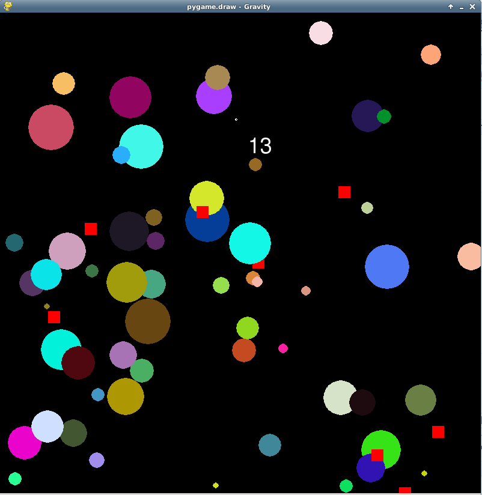

gravity-game
============

2D arcade-style game where you control a black hole and have to draw planets in to score points, while avoiding bad things that make you eject all of the planets you've collected.

Written in Python with [PyGame](http://pygame.org/) for the 2006 [pygame.draw](http://media.pyweek.org/static/pygame.draw-0606.html) competition.

Dependencies
------

* [PyGame](http://pygame.org/)

Screenshot
-----

